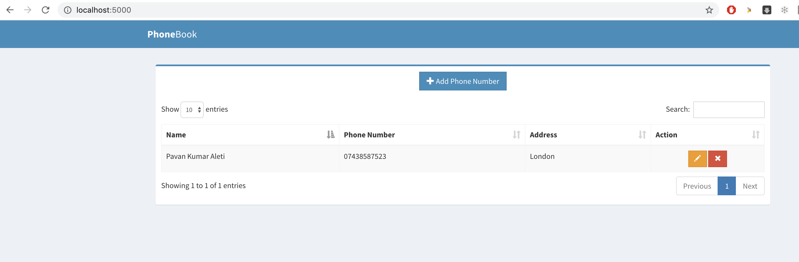

# Docker Flask MySQL crud_flask

A simple CRUD application using Flask and MySQL with docker

Usage:
------

1. `git clone https://github.com/aleti-pavan/docker-flask-crud.git`

2. `cd docker-flask-crud\`

3. `docker-compose up -d` to start the app in detach mode

4. `docker-compose down` to stop the app

Access:
-------

http://< ip >:5000

where `ip` is either `localhost / 127.0.0.1` or docker ip host. App should appear something like below

